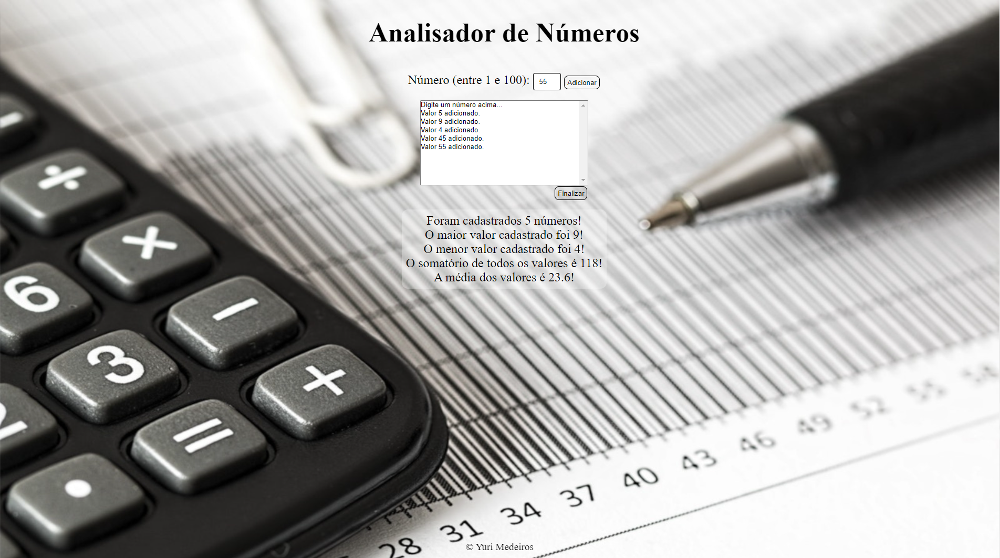
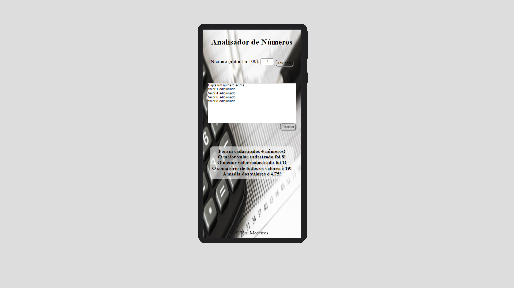

# NumberAnalyzer

### About NumberAnalyzer / Sobre o NumberAnalyzer

The 'NumberAnalyzer' project was designed and developed with the aim of providing an application that could perform an analysis based on some given numbers.
 
The conclusion of this project allowed the applied use of programming logic in JavaScript, and also the use of styles in CSS related to flexbox.
 
 
O projeto 'NumberAnalyzer' foi projetado e desenvolvido com o objetivo de fornecer uma aplicação que pudesse realizar uma analise com base em alguns números fornecidos. 
 
A conclusão desse projeto, possibilitou o uso aplicado da lógica programacional em JavaScript, e também o uso de estilos em CSS relacionados ao flexbox.

 
 

> NumberAnalyzer Interface running in a Large Screen/ Interface do NumberAnalyzer(Tabuada de) funcionando em uma tela de alta escala.

> NumberAnalyzer Interface running in a Mobile Screen/ Interface do NumberAnalyzer(Tabuada de) funcionando em um dispositivo móvel.

### Click at link below to see it working! / Clique no link abaixo para vê-lo funcionando!
<a href="https://yurimayk.github.io/NumberAnalyzer/">Clique aqui!</a>

### Project steps/Etapas do Projeto

The project is not under development. Below are the definitions of performed tasks to finish it:
 
O projeto não está em desenvolvimento. Abaixo estão as definições de tarefas executadas para finalizá-lo:

- [x] Create HTML/Criar estrutura HTML;
- [x] Create CSS/Estilização com CSS;
- [x] Improve responsiveness/Aprimorar responsividade;
- [x] Add JavaScript/Adicionar JavaScript;
- [x] Make the project available online/Disponibilizar o projeto, online;

## 🤝 Contributor/Colaborador

The creator, and developer, of this project:
 
O criador e desenvolvedor deste projeto:

<table>
  <tr>
    <td align="center">
      <a href="#">
         
        
          <a href="https://www.linkedin.com/in/yurimayk/" target="_blank"><b>Yuri Medeiros</b></a>
        
      </a>
    </td>
</table>

[⬆ Voltar ao topo](#nome-do-projeto) 
